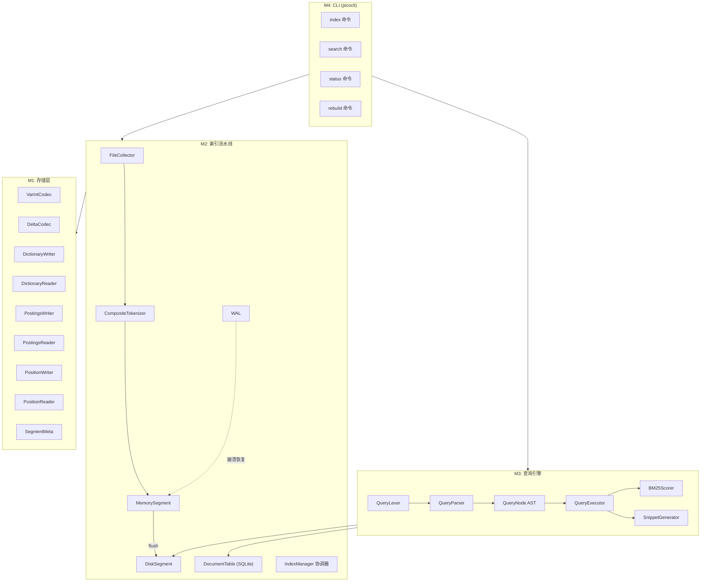

# 高性能本地搜索引擎 — 项目设计文档

> **目标**：从零实现高性能本地文件全文搜索引擎，不依赖 Lucene 等搜索框架。  
> **技术栈**：Java 21 LTS · Gradle 8.6 · SQLite · picocli · Logback · JMH  

---

## 1. 需求概述

| 维度 | 指标 |
|------|------|
| 数据规模 | 10 万文件，5GB 文本 |
| 索引时间 | 全量 ≤ 5 分钟（SSD） |
| 查询延迟 | P99 ≤ 50ms |
| 崩溃恢复 | WAL 保证索引元数据一致性与可恢复到最近提交点 |
| 增量更新 | 文件 mtime 变更检测 |

### 1.1 核心功能
- 倒排索引 + 位置索引
- BM25 相关性评分
- 自定义 Query DSL（布尔 / 短语 / 前缀 / 字段过滤 / 范围查询）
- CLI 交互（index / search / status / rebuild）
- 命中高亮摘要 (snippet)

### 1.2 不做什么
- 不做 HTTP API（后续扩展）
- 不做分布式
- 不做实时流式索引

---

## 2. 架构总览



### 2.1 数据流

```
文件系统
  ↓ FileCollector (递归发现 + 扩展名过滤)
  ↓ CompositeTokenizer (英文 + CJK Bigram)
  ↓ MemorySegment (内存倒排 + 位置表)
  ↓ flush 触发 (docCount ≥ 10K 或 bytes ≥ 64MB)
  ↓ DiskSegment (Dictionary + Postings + Positions 三文件)
  ↓ 段合并 (Tiered merge, 同层 ≥ 10 段触发)
```

---

## 3. 模块详细设计

### M1: 存储基础

#### 3.1 编码器

| 组件 | 职责 | 关键算法 |
|------|------|----------|
| `VarIntCodec` | 变长整数编解码 | 每字节 7 位有效 + 1 位续接标志 |
| `DeltaCodec` | 有序整数序列压缩 | Delta 编码 + VarInt 组合 |

#### 3.2 文件格式

**词典文件 (.dict)**
```
[Header]  magic(4B) | version(2B) | termCount(4B)
[Entry]   termLen(VarInt) | termBytes(UTF-8) | docFreq(VarInt) | postingsOffset(8B) | positionsOffset(8B)
...重复 N 次（按字典序），term 严格递增排序...
[Footer]  CRC32(4B)
```

**倒排列表文件 (.inv)**
```
[Header]  magic(4B) | version(2B)
[PostingList]
  docCount(VarInt) | skipCount(VarInt)
  [SkipEntry] skipDocId(4B) | skipOffset(8B) × skipCount
  [DocIds]    delta-encoded VarInt × docCount
  [TermFreqs] VarInt × docCount
[Footer]  CRC32(4B)
```

**位置表文件 (.pos)**
```
[Header]  magic(4B) | version(2B)
[PositionBlock]
  docCount(VarInt)
  [PerDoc] docId(VarInt) | posCount(VarInt) | positions(delta-VarInt × posCount)
[Footer]  CRC32(4B)
```

**段元数据 (.meta)** — JSON 格式
```json
{
  "segmentId": "seg_00001",
  "docCount": 5000,
  "termCount": 120000,
  "sizeBytes": 15000000,
  "status": "ACTIVE",
  "level": 0,
  "createTime": "2026-02-19T06:00:00Z"
}
```

#### 3.3 常量定义

| 常量 | 值 | 说明 |
|------|----|------|
| `SKIP_INTERVAL` | 128 | 跳表间隔 |
| `MEMORY_SEGMENT_MAX_DOCS` | 10,000 | 内存段文档上限 |
| `MEMORY_SEGMENT_MAX_BYTES` | 64MB | 内存段字节上限 |
| `MERGE_FACTOR` | 10 | 段合并阈值 |
| `BM25_K1` | 1.2 | 词频饱和系数 |
| `BM25_B` | 0.75 | 长度归一化系数 |
| `SNIPPET_CONTEXT_CHARS` | 80 | Snippet 单侧上下文字符数 |
| `MAX_SNIPPETS` | 3 | 最大 snippet 数 |
| `WAL_MAX_SIZE` | 16MB | WAL 最大大小 |

---

### M2: 索引流水线

#### 3.4 文档模型

```java
// 不可变记录
record Document(int docId, Path path, String extension, long sizeBytes,
                Instant mtime, DocType docType, int tokenCount)
enum DocType { CODE, NOTE, DOC, DATA, CONFIG, OTHER }
```

#### 3.5 DocumentTable (SQLite)

```sql
CREATE TABLE documents (
    doc_id      INTEGER PRIMARY KEY,
    path        TEXT UNIQUE NOT NULL,
    extension   TEXT,
    size_bytes  INTEGER,
    mtime       TEXT,           -- ISO-8601
    doc_type    TEXT,
    token_count INTEGER DEFAULT 0,
    content_hash TEXT,
    is_deleted  INTEGER DEFAULT 0,
    deleted_at  TEXT,
    last_scan_id TEXT
);
CREATE INDEX idx_path ON documents(path);
CREATE INDEX idx_ext ON documents(extension);
CREATE INDEX idx_mtime ON documents(mtime);
CREATE INDEX idx_deleted ON documents(is_deleted);
```

**提供的查询方法**：
- `findByPath(path)` / `findById(docId)` — 仅返回存活文档
- `findDocIdsByExtension(ext)` — 按扩展名过滤
- `findDocIdsByType(type)` — 按文档类型过滤
- `findDocIdsByMtimeRange(from, to)` — 按修改时间范围
- `findDocIdsBySizeRange(min, max)` — 按大小范围
- `findDocIdsByPathPrefix(prefix)` — 按路径前缀
- `getAverageDocLength()` — BM25 所需平均文档长度
- `markDeletedByPath(path)` — 软删除并保留 docId
- `markScanId(docId, scanId)` / `markMissingAsDeleted(scanId)` — 增量扫描删除检测

#### 3.6 分词器 (SPI)

```java
interface Tokenizer {
    List<Token> tokenize(String text);
    record Token(String term, int position, int startOffset, int endOffset) {}
}
```

| 实现 | 策略 |
|------|------|
| `EnglishTokenizer` | 非字母数字分割 → 小写 → 过滤单字符 → 可选停用词 |
| `BigramTokenizer` | 连续 CJK 字符两两切分（"搜索引擎" → "搜索","索引","引擎"）|
| `CompositeTokenizer` | 按字符类型切换委托，维护全局递增 position |

#### 3.7 WAL (Write-Ahead Log)

```
格式: [op(1B)] [timestamp(8B)] [docId(VarInt)] [pathLen(VarInt)] [path(UTF-8)] [mtime(8B)] [size(8B)] [hashLen(VarInt)] [contentHash(UTF-8)]
操作: ADD=1, DELETE=2, UPDATE=3
```
- 写前日志，保证崩溃后可通过重放恢复到最近提交点
- 超过 `WAL_MAX_SIZE` 后轮转 (`.wal.old`)
- 成功 flush 后 checkpoint 清空

**提交协议（原子提交点）**
1. `WAL append + fsync`
2. `MemorySegment flush` 到临时段文件并校验
3. 原子更新 `segments.gen` 并 `fsync`
4. 持久化 `liveDocs/tombstone` 视图并 `fsync`
5. 执行 `WAL checkpoint`

恢复时以 `segments.gen + liveDocs` 为准，WAL 只重放未提交完成的操作。

#### 3.7.1 删除与更新模型（liveDocs / tombstone）

- 每个段维护 `segmentId.del`（docId 集合或位图）作为持久化删除集
- 查询阶段过滤链路：`PostingList -> liveDocs -> DocumentTable(is_deleted=0)`
- merge 阶段吸收删除：新段不写入已删除 docId
- UPDATE 等价于 `DELETE oldDocId + ADD newDocId`，旧文档通过 tombstone 保持不可见

#### 3.8 IndexManager

**并发模型**：生产者-消费者

```
FileCollector (生产者线程)
    ↓ BlockingQueue<FileInfo> (capacity=1000)
N × IndexWorker (消费者线程池)
    ↓ 读文件 → tokenize → 写 MemorySegment
    ↓ 大小/数量阈值 → flush → DiskSegment
```

**关键方法**：
- `buildIndex(sourcePaths)` — 全量构建
- `rebuild(sourcePaths)` — 删除现有索引后重建
- `flushMemorySegment()` — 内存段 flush 到磁盘
- `recoverFromWal()` — 基于 WAL 的崩溃恢复
- `getActiveSegments()` — 获取查询快照（读写锁保护）

---

### M3: 查询引擎

#### 3.9 Query DSL 语法

```bnf
query       = or_expr [ sort_expr ]
or_expr     = and_expr { 'OR' and_expr }
and_expr    = unary_expr { ('AND' | implicit_and) unary_expr }
unary_expr  = [ 'NOT' | '-' ] primary
primary     = group | field_expr | phrase | prefix | term
group       = '(' or_expr ')'
field_expr  = FIELD ':' ( range | value )
range       = value '..' value
phrase      = '"' words '"'
prefix      = term '*'
sort_expr   = 'sort:' field_name
```

**运算符优先级与结合性**：`NOT > AND(含隐式AND) > OR`，同级左结合。

**sort 规则**：
- 仅允许出现在顶层末尾（例如 `error timeout sort:mtime`）
- 最多出现一次，多次出现按语法错误处理

**示例**：
```
hello world                          # 隐式 AND
"distributed system"                 # 短语查询（位置验证）
config*                              # 前缀匹配
error AND (timeout OR retry)         # 布尔组合 + 括号
-draft NOT internal                  # 排除
ext:md type:note                     # 字段精确过滤
mtime:2025-01-01..2025-12-31         # 日期范围
size:10KB..5MB                       # 大小范围
path:/work/src                       # 路径前缀
sort:mtime                           # 按修改时间排序
```

#### 3.10 AST 节点 (sealed interface)

```
QueryNode
  ├── TermQuery(term)
  ├── PrefixQuery(prefix)
  ├── PhraseQuery(terms[])
  ├── BooleanQuery(op, left, right)   op ∈ {AND, OR}
  ├── NotQuery(child)
  ├── FieldQuery(field, value)
  ├── RangeQuery(field, from, to)
  └── SortDirective(field)
```

#### 3.11 查询执行流程

```
1. QueryLexer.tokenize(queryString) → List<LexToken>
2. QueryParser.parse(tokens) → QueryNode AST + SortDirective
3. 遍历 AST，对每个 DiskSegment：
   ├── TermQuery  → 读 PostingList → 逐 doc 累加 BM25
   ├── PrefixQuery → DictionaryReader.prefixSearch → 合并多个 PostingList
   ├── PhraseQuery → 多 PostingList 交集 → 位置表验证相邻性
   │                 检查 pos[i+1] = pos[i] + 1
   ├── BooleanQuery(AND) → 左右子树各获 docId 集合 → 交集，分数相加
   ├── BooleanQuery(OR)  → 左右子树 → 并集
   ├── NotQuery → 子树获取 excludeSet → 从结果中移除
   ├── FieldQuery → DocumentTable SQL 查询 → docId 集合
   └── RangeQuery → DocumentTable SQL 范围查询 → docId 集合
4. 排序 (relevance / mtime / size)
5. Top-N 截断
6. SnippetGenerator 生成高亮摘要
```

#### 3.12 BM25 评分

```
BM25(D, Q) = Σ(t∈Q) IDF(t) × (tf × (k1+1)) / (tf + k1 × (1 - b + b × |D|/avgDL))

IDF(t) = ln((N - df + 0.5) / (df + 0.5) + 1)

参数: k1=1.2, b=0.75
```

**多段统计口径（必须）**：
- `N`：仅统计存活文档数（`is_deleted=0`）
- `avgDL`：仅基于存活文档 `token_count` 计算
- `df(term)`：跨所有 active segments 的全局文档频次（过滤 liveDocs）

实现方式：
- 启动加载时构建 `GlobalTermStats(term -> globalDf)`
- flush / merge 后增量刷新统计
- 若采用近似（per-segment df），必须显式标注“排序质量退化，不保证跨段稳定性”

#### 3.13 Snippet 生成

1. 在文档文本中定位 queryTerm 出现位置
2. 取 `±80 字符` 上下文窗口
3. 对齐到单词边界
4. 合并重叠窗口
5. 按 term 密度排序，取 Top-3
6. 应用 ANSI 转义高亮 (`\033[1;33m ... \033[0m`)

---

### M4: CLI

```
lse [--index-dir <path>] [--note-dir <path>] [--threads <n>] <subcommand>

子命令:
  index   <path...>               构建/增量更新索引
  search  "<query>" [-l N] [-f text|json]   执行查询
  status                          查看索引统计
  rebuild <path...>               全量重建
```

### M5: 段合并 (Tiered Merge)

```
Level 0: 新 flush 的段（小段）
Level 1: 合并 10 个 Level 0 → 1 个 Level 1
Level 2: 合并 10 个 Level 1 → 1 个 Level 2
...

合并过程：
1. 选择同层 ≥ MERGE_FACTOR 个段
2. 多路归并排序所有 term
3. 合并倒排列表（跳过 liveDocs 中已删除 docId）
4. 写入新段 → 原子替换 segments.gen
5. 删除旧段文件并清理对应 tombstone
```

---

## 4. 项目结构

```
local-search-engine/
├── build.gradle.kts
├── settings.gradle.kts
├── docs/
│   └── PROJECT_SPEC.md          ← 本文件
└── src/
    ├── main/java/com/localengine/
    │   ├── config/
    │   │   ├── Constants.java       # 全局常量
    │   │   └── EngineConfig.java    # 运行配置
    │   ├── storage/
    │   │   ├── VarIntCodec.java     # VarInt 编解码
    │   │   ├── DeltaCodec.java      # Delta 编码
    │   │   ├── DictionaryWriter.java
    │   │   ├── DictionaryReader.java
    │   │   ├── PostingsWriter.java
    │   │   ├── PostingsReader.java
    │   │   ├── PositionWriter.java
    │   │   ├── PositionReader.java
    │   │   └── SegmentMeta.java
    │   ├── document/
    │   │   ├── Document.java        # 文档模型
    │   │   ├── DocumentTable.java   # SQLite 元数据表
    │   │   └── FileCollector.java   # 文件发现
    │   ├── text/
    │   │   ├── Tokenizer.java       # 分词 SPI
    │   │   ├── StopWords.java
    │   │   ├── EnglishTokenizer.java
    │   │   ├── BigramTokenizer.java
    │   │   └── CompositeTokenizer.java
    │   ├── index/
    │   │   ├── WAL.java             # Write-Ahead Log
    │   │   ├── MemorySegment.java   # 内存段
    │   │   ├── DiskSegment.java     # 磁盘段
    │   │   └── IndexManager.java    # 索引协调器
    │   ├── query/
    │   │   ├── QueryNode.java       # AST 定义
    │   │   ├── QueryLexer.java      # 词法分析
    │   │   ├── QueryParser.java     # 语法解析
    │   │   ├── QueryParseException.java
    │   │   └── QueryEngine.java     # 查询执行
    │   ├── scoring/
    │   │   └── BM25Scorer.java
    │   ├── highlight/
    │   │   └── SnippetGenerator.java
    │   └── cli/
    │       └── MainCommand.java     # picocli 入口
    ├── main/resources/
    │   └── logback.xml
    └── test/java/com/localengine/
        ├── storage/
        │   ├── CodecTest.java
        │   └── StorageRoundTripTest.java
        ├── text/
        │   └── TokenizerTest.java
        └── query/
            └── QueryParserTest.java
```

---

## 5. 依赖清单

```kotlin
// build.gradle.kts
dependencies {
    implementation("info.picocli:picocli:4.7.6")
    annotationProcessor("info.picocli:picocli-codegen:4.7.6")
    implementation("com.fasterxml.jackson.core:jackson-databind:2.17.0")
    implementation("com.fasterxml.jackson.datatype:jackson-datatype-jsr310:2.17.0")
    implementation("org.xerial:sqlite-jdbc:3.45.1.0")
    implementation("org.slf4j:slf4j-api:2.0.12")
    implementation("ch.qos.logback:logback-classic:1.5.3")
    testImplementation("org.junit.jupiter:junit-jupiter:5.10.2")
    jmh("org.openjdk.jmh:jmh-core:1.37")
}
```

---

## 6. 开发里程碑

| 阶段 | 模块 | 交付物 | 预估工时 |
|------|------|--------|---------|
| **P0** | M1 存储基础 | 编解码器 + 三种文件格式读写器 | 2 天 |
| **P1** | M2 索引流水线 | 完整索引构建管线 (并发 + WAL) | 3 天 |
| **P2** | M3 查询引擎 | Query DSL + BM25 + Snippet | 2 天 |
| **P3** | M4 CLI | 四子命令可用 | 0.5 天 |
| **P4** | M5 段合并 | Tiered merge + 增量更新 | 2 天 |
| **P5** | M6 测试 | 单元 + 集成 + 基准 (覆盖率 ≥ 80%) | 2 天 |

---

## 7. 关键设计决策

| 决策 | 选择 | 理由 |
|------|------|------|
| 元数据存储 | SQLite | 字段过滤（path/ext/mtime/size/type）天然适合 SQL |
| 倒排索引存储 | 自定义二进制文件 | 避免 SQLite 大 BLOB 性能问题，控制压缩和跳表 |
| 分词 | Bigram(CJK) + Split(EN) | 无词典依赖，开箱即用，质量可接受 |
| 压缩 | Delta + VarInt | 倒排列表是单调递增 docId 序列，Delta 后大部分值 ≤ 127 |
| 并发 | 生产者-消费者 | 索引吞吐量瓶颈是 IO，多消费者并行分词和构建内存段 |
| 崩溃恢复 | WAL | 段文件不可变，只需保护内存段中未 flush 的数据 |
| 段合并 | Tiered | 控制读放大，同时避免大段频繁重写 |
